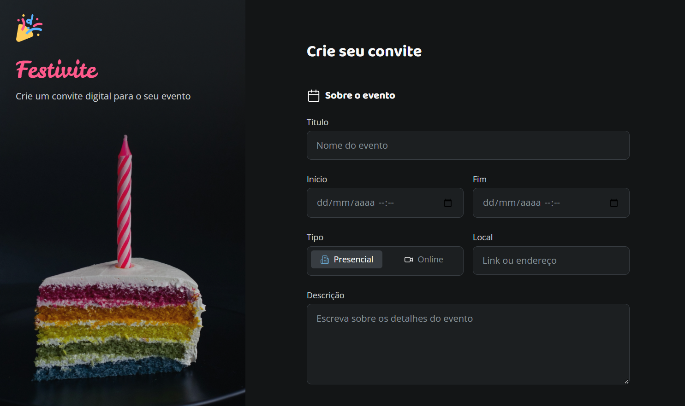

<h1> 🚀 Desafio prático - Formulário de Convite</h1>

  

## 🚀 Tecnologias

Esse projeto foi desenvolvido com as seguintes tecnologias:

- HTML e CSS
- Git e Github
- Figma

## 💻 Projeto

Página web para criar um formulário de convite.
Este projeto foi realizado como um desafio prático no curso de Fullstack da Rocketseat na aula sobre formuários, onde fui responsável por todo o desenvolvimento, aplicando os conhecimentos adquiridos ao longo das aulas.
